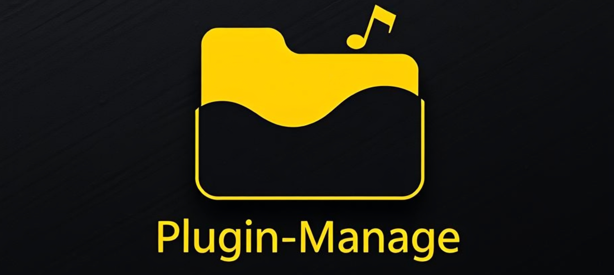
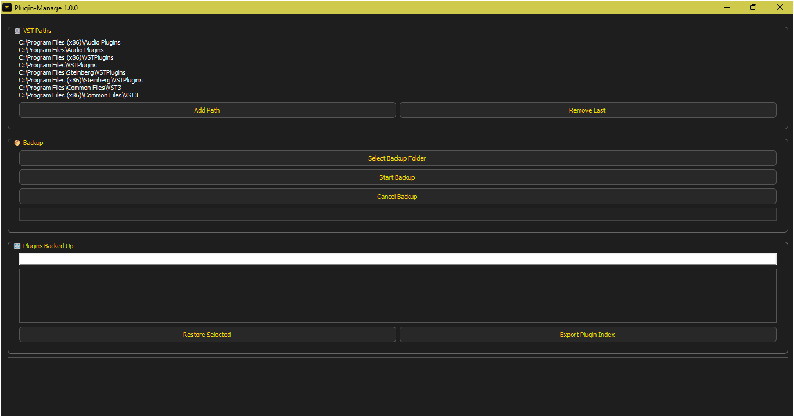

🔗 [Download .exe from Google Drive](https://drive.google.com/file/d/1dc7OsdJzTLPje-56U5KElxpkMNY1HEg7/view?usp=sharing)

---



**Plugin-Manage** is an all-in-one desktop application for managing and backing up VST plugins (`.dll` and `.vst3`). Organize, back up, categorize, search, and restore your plugins efficiently and professionally.

⚠️ _It's recommended to run as administrator to ensure full access to all system folders._

---



---

## 🌟 Key Features

- **Comprehensive plugin management** through a modern and efficient interface.
- **Full support** for `.dll` and `.vst3` formats.
- **Automatic detection** of vendor, architecture, and type.
- **Multiple path selection** with options to add and remove.
- **Clear visualization** of progress and process events.
- **Duplicate prevention**: avoids copying already existing files.
- **Safe mode**: cancel at any time.
- **Smart plugin search** by name.
- **Direct restoration** of selected plugins.
- **Index export** for backup or external analysis.

---

## 🧭 How to Use

1. Open the application.
2. Add VST plugin paths if desired.
3. Select the backup destination folder.
4. Click “Start Backup” to begin.
5. Monitor progress and logs in real time.
6. Cancel if needed with “Cancel Backup”.
7. Search for plugins using the built-in search bar.
8. Restore any plugin with one click.
9. Export the full metadata index if needed.

---

## 📁 Backup Structure

```
[Backup Folder]/
│
├── VST2/
│   ├── 32_bit/
│   │   └── VendorName/
│   │       └── plugin.dll
│   └── 64_bit/
│       └── VendorName/
│           └── plugin.dll
└── VST3/
    ├── 32_bit/
    └── 64_bit/
        └── VendorName/
            └── plugin.vst3

+ backup_index.json
```

---

## 💻 System Requirements

- **Operating System**: Windows 10 or higher
- **RAM**: 4 GB minimum (8 GB recommended)
- **Processor**: Multi-core CPU
- **Disk Space**: Depends on the size of your VST plugins

---

## 🧪 Technologies Used

- **Python 3**
- **PyQt5** – Modern graphical interface
- **shutil / os / json** – Standard file handling and serialization

---

## 🪪 License

This project is licensed under the MIT License. See the `LICENSE` file for details.

---

## 🤝 Contributions

Contributions are welcome!

1. Fork the repository
2. Create a new branch for your changes
3. Make your improvements or fixes
4. Open a pull request with a clear description

Found a bug or have a suggestion? Get in touch!
📧 **[negroayub97@gmail.com](mailto:negroayub97@gmail.com)**

**Thank you for using Plugin-Manage and helping improve VST plugin organization.** 🎶
